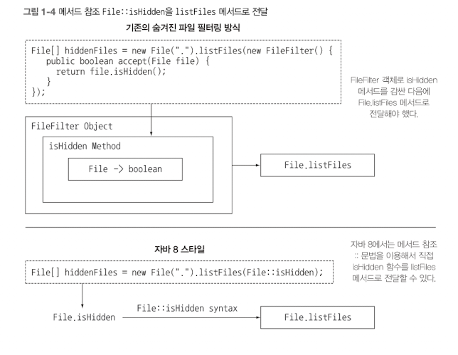

## 1.1 역사의 흐름은 무엇인가?

자바 역사에 통들어 가장 큰 변화가 자바 8에서 일어났다.

고전적 코드

```java
Collections.sort(inventory, new Comparator<Apple>() {
	public int compare(Apple a1, Apple a2) {
		return a1.getWeight().compareTo(a2.getWeight());
		}
});
```

이 코드는 컬렉션 프레임워크로 sort 메서드를 호출합니다. 그리고 두번째 매개변수를 보면 Comparator을 선언을 했습니다. 그러면 compare을 재정의를 해줘야 합니다. 그리고 사과1, 사과2의 무게를 가져와서 서로 비교해서 정렬을 해주는 코드입니다. **한 마디로 하면 사과 무게를 비교하는 코드입니다.** 이 코드를 자바 8을 이용하면 자연어에 더 가깝게 간단한 방식으로 코드를 구현 할 수 있습니다.

```java
inventory.sort(comparing(Apple::getWeight));
```

멀티코어 CPU 같은 하드웨어적인 변화도 자바 8에 영향을 줬습니다. 지금까지의 대부분의 자바는 코어 중 하나만을 사용했습니다.

자바 8이전에는 나머지 코어를 활용하는 방법으로 스레드를 사용하는 것이 좋다고 했습니다. 하지만 스레드를 사용하면 관리하기 어렵고 많은 문제가 발생했습니다.

자바는 병렬 실행 환경을 쉽게 관리하고 에러가 덜 발생하는 방향으로 발전했습니다. 자바 8에서는 병렬 실행을 새롭고 단순한 방식으로 접근할 수 있는 방법을 제공합니다.

**자바 8에서 제공하는 새로운 기술들**

- 스트림 API
- 메서드에 코드를 전달하는 기법
- 인터페이스의 디폴트 메서드

스트림을 이용하면 에러를 자주 일으키면 멀티코어 CPU를 이용하는 것보다 비용이 훨씬 비싼 키워드 synchronized를 사용하지 않아도 된다.

자바 8에서 추가된 두가지 기능, 코드를 전달하는 간결 기법(메서드 참조와 람다)와 인터페이스의 디폴트 메서드가 존재 할 수 있음을 알 수 있다.

자바 8기법은 함수형 프로그래밍에서 위력을 발휘한다.

## 1.2 왜 아직도 자바는 변화하는가?

자바는 처음부터 스레드와 락을 이용한 소소한 동시성을 지원하면서 잘 설계된 객체지형 언어로 시작했습니다. 코드를 JVM바이트 코드를 컴파일러하는 특징(모든 브라우저를 가상 머신 코드를 지원하기 때문이다.) 때문에 자바는 인터넷 애플릿 프로그램의 주요 언어가 되었다.

프로그래머는 빅데이터라는 도전에 직면하면서 멀티코어 컴퓨터나 컴퓨팅 클러스터를 이용해서 빅데이터를 효과적으로 처리할 필요성이 커졌다. 즉, 병렬 프로세싱을 활용해야 하는 데 지금까지의 자바로는 대응할 수 없다.

자바는 8은 더 다양한 프로그래밍 도구 그리고 다양한 프로그래밍 문제를 더 빠르고 정확하며 쉽게 유지보수 할 수있다는 장점을 제공한다. 이 책은 병렬성을 활용하는 코드, 간결한 코드를 구현할 수 있도록 자바 8에서 제공하는 기능의 모태인 세가지 프로그래밍 개념을 자세히 설명한다.

### 스트림 처리

스트림이란 한 번에 한 개씩 만들어지는 연속적인 데이터 항목들의 모임이다.

이론적으로 프로그램은 입력 스트림에서 데이터를 한 개씩 읽어 들이며 마찬가지로 출력 스트림으로 데이터를 한 개씩 기록한다. 즉, 어떤 프로그램의 출력 스트림은 다른 프로그램의 입력 스트림이 될 수 있다.

자바 8에서는 java.util.stram 패키지에 스트림 API가 추가되었다. 스트림 패키지에 정의된 Straem<T>는 T형식 구성된 일련의 항목을 의미한다. 스트림 파이프라인을 이용해서 입력 부분을 여러 부분을 여러 CPU 코어에 쉽게 할당할 수 있다는 부가적인 이득도 얻을 수 있다. 스레드라는 복잡한 작업을 사용하지 않으면서도 공짜로 병렬성을 얻을 수 있다. (ParallelStream에 해당한다.)

### 동작 파라미터화로 메서드에 코드 전달하기

자바8에서 추가된 두 번째 프로그램 개념은 코드 일부를 API로 전달하는 기능이다. 자바8에서는 **메서드를 다른 메서드의 인수로 넘겨주는 기능**을 한다. 이와 같은 개념을 **동작 파라미터화**라고 한다.

### 병렬성과 공유 가변 데이터

자바8에서는 ‘병렬성을 공짜로 얻을 수 있다’라는 말이 있다. 스트림 메서드로 전달하는 코드는 다른 코드와 동시에 실행하더라도 안전하게 안전하게 실행할 수 있어야 한다. 보통 다른 코드와 동시에 실행하더라도 안전하게 실행할 수 있는 코드를 만들려면 공유된 가변 데이터에 접근하지 않아야 한다. 이러한 함수를 순수 함수, 부작용 없는 함수, 상태 없는 함수라 부른다.

기존처럼 synchronized를 이용해서 공유된 가변 데이터를 보호하는 규칙을 만들 수 있을 것이다.(일반적으로 synchronuized는 시스템 성능에 악영항을 미친다.) 하지만 자바 8 스트림을 이용하면 기존의 자바 스레드 API보다 쉽게 병렬성을 활용 할 수 있다. 다중 프로세싱 synchronized를 사용하면 비싼 대가를 치러야 한다.

### 자바가 진화해야 하는 이유

기존 값을 변화시키는 데 집중했던 고전적인 객체지향에서 벗어나 함수형 프로그래밍으로 다가섰다는 것이 자바 8의 가장 큰 변화다. 그리고 언어는 하드웨어나 프로그래머 기대의 변화에 부응하는 방향으로 변화해야 한다.

## 1.3 자바 함수

프로그래밍 언어에서 함수라는 용어는 메서드 특히 정적 메서드와 같은 의미로 사용된다. 자바의 함수는 이에 더해 수학적인 함수처럼 사용되며 부작용을 일으키지 않는 함수를 의미한다.

자바 8에서는 함수를 새로운 값의 형식으로 추가했다. 멀티코어에서 병렬 프로그래밍을 활용할 수 있는 스트림과 연계될 수 있도록 함수를 만들었기 때문이다. 그리고 자바는 런타임에 메서드를 전달 할 수 있도록 하는것 같다.

### 메서드와 람다를 일급 시민으로

메서드 참조라는 새로운 자바 8의 기능을 소개한다.

```java
File[] hiddenFiles = new File(".").listFiles(new FileFilter() {
	public boolean accept(File file) {
		return file.isHidden();
		}
});
```

File 클래스에는 이미 isHidden이라는 메서드가 있는데 굳이 FileFilter로 isHidden을 복잡하게 감싼 다음에 FileFilter를 인스턴스화 시켜야 될까?

하지만 자바 8에서는 다음처럼 코드를 구현할 수 있다.

```java
Filep[] hiddenFiles = new File(".").listFiles(File::isHidden);
```

이미 isHidden이라는 함수는 준비되어 있으므로 자바 8의 메소드 참조 ::(”이 메소드를 값으로 사용하라”는 의미)를 이용해서 listFiles에 직접 전달할 수 있다.

### 람다: 익명 함수

자바 8에서는 메서드를 일급값으로 취급할 뿐 아니라 람다(또는 익명 함수)를 포함하여 함수도 값으로 취급할 수 있다. 예를 들어 (int x) → x + 1, 즉 ‘x라는 인 수로 호출하면 x + 1을 반환’하는 동작을 수행하도록 코드를 구현할 수 있다.



### 코드 넘겨주기 : 예제

Apple 클래스와 getColor 메서드가 있고, Apples 리스트를 포함하는 변수 inventory가 있다고 가정하자. 이때 모든 녹색 사과를 선택해서 리스트를 반환하는 프로그램을 구현하려 한다. 이처럼 특정 항목을 선택해서 반환하는 동작을 필터라고한다.

자바8이전

```java
public static List<Apple> filterGreenApples(List<Apple> inventory) {
	List<Apple> result = new ArrayList<>();
	
	for (Apple apple : inventory) {
		if (GREEN.equals(apple.getColor())) {
			result.add(apple);
		}
	}
	 return result;
}
```

사과를 무게로 필터링하는 경우는 다음과 같을 것이다.

```java
public static List<Apple> filterHeavyApples(List<Apple> inventory) {
	List<Apple> result = new ArrayList<>();
	
	for (Apple apple : inventory) {
		if (apple.getWeight > 150) {
			result.add(apple);
		}
	}
	 return result;
}
```

소프트웨어공학적인 면에서 복사 & 붙여넣기의 단점이 무엇인지 알고 있을 것이다(어떤 코드가 버그가 있으면 모두 고쳐야 한다). 이 예제에서는 사과를 필터링하는 부분만 다른다.

자바 8에서는 코드를 인수로 넘겨줄 수 있으므로 filter 메서드를 중복으로 구현할 필요가 없다.

```java
public static boolean isGreenApple(Apple apple) {
	return GREEN.equals(apple.getColor());
}

public static boolean isHeavyApple(Apple apple) {
	return apple.getWeight() > 150;
}

public interface Predicate<T> {
	boolean test(T t);
}

static List<Apple> filterApples(List<Apple> inventory, Predicate<Apple> p) {
	List<Apple> result = new ArrayList<>();
	
	for (Apple apple : inventory) {
		if (p.test(apple)) {
			result.add(apple);
		}
	}
	return result;
}
```

다음처럼 메서드를 호출할 수 있다.

```java
filterApples(inventory, Apple::isGreenApple);
filterApples(inventory, Apple::isHeavyApple);
```

**Predicate란?**

함수형 인터페이스(구현해야할 메서드가 하나일때 함수형 인터페이스라고 한다. 종류는 다양하게 많다.)

filterApples는 Apple::isGreenApple 메서드를 Predicate<Apple>이라는 타입의 파라미터로 받는다. 인수로 값을 받아 true나 false를 반환하는 함수다.

### 메서드 전달에서 람다로

메서드를 값으로 전달받는 것은 분명 유요한 기능이다. 하지만 isHeavyApple, isGreenApple처럼 한 두 번만 사용할 메서드를 매번 정의하는 것은 귀찮은 일이다. 자바 에서는 이 문제도 간단히 해결 할 수 있다. 자바8에서는 익명함수 또는 람다라는 새로운 개념을 이용해서 코드를 변경할 수 있다.

```java
filterApples(inventory, (Apple a) -> GREEN.equals(a.getColor()));
filterApples(inventory, (Apple a) -> a.getWeight() > 150);
filterApples(inventory, (Apple a) -> a.getWeight() < 80 || RED.equals(a.getColor()));
```

즉, 한 번만 사용할 메서드는 따로 정의할 필요가 없다. 위 코드는 우리가 넘겨주려는 코드를 애써 찾을 필요가 없을 정도로 더 짧고 간결하다.

하지만 람다가 몇 줄 이상으로 길어진다면(즉, 조금 복잡한 동작을 수행하는 상황) 익명 람다보다는 코드가 수행하는 일을 잘 설명하는 이름을 가진 메서드를 정의하고 참조를 활용하는 것이 바람직하다. 코드의 명확성이 우선시되어야 한다.

자바는 멀티코어 CPU에 의해 함수형 프로그래밍이 얼마나 강력한지 증명해왔다. 아마도 자바는 filter 그리고 다음과 같은 몇몇 일반적인 라이브러리 메서드를 추가하는 방향으로 발전했을 수도 있다.

```java
static <T> Collection<T> filter(Collection<T> c, Predicate<T> p);
```

예를 들어 이전 메서드에서는 다음처럼 filterApples를 사용하였다.

```java
filterApples(inventory, (Apple a) -> a.getWeight() > 150);
```

하지만 다음처럼 라이브러리 메서드 filter를 사용하면 filterApples 메서드를 구현할 필요가 없다.

```java
filter(inventory, (Apple a) -> a.getWeight() > 150);
```

하지만 병렬성이라는 중요성 때문에 설게자들은 이와 같은 설계를 포기했다. 대신 자바 8에서는 filter와 비슷한 동작을 수행하는 연산집합을 포함하는 새로운 스트림 API(컬렉션과 비슷하며 함수형 프로그래머에게 더 익숙한 API)를 제동한다. 또한 컬렉션과 스트림 간에 변환할 수 있는 메서드 (map, reduce)도 제공한다.

## 1.4 스트림

스트림 API를 이용하면 컬렉션 API와는 상당히 다른 방식으로 데이터를 처리할 수 있다는 사실만 기억하자. 컬렉션에는 반복 과정을 직접 처리해야 했다. 즉 for-each 루프를 이용해서 각 요소를 반복하면서 작업을 수행했다. 이런 방식의 반복을 **외부 반복**이라고 한다. 반면 스트림 API를 이용하면 루프를 신경쓸 필요가 없다. 스트림 API에서는 라이브러리 내부에서 모든 데이터가 처리된다. 이와 같은 반복을 **내부 반복**이라고 한다.

### 멀티스레딩은 어렵다.

이전 자바 버전에는 스레드 API 멀티스레딩 코드를 구현해서 병렬성을 이용하는 것은 쉽지 않다. 멀티스레딩 환경에서 각각의 스레드는 동시에 공유된 데이터에 접근하고, 데이터를 갱신할 수 있다. 결과적으로 스레드를 잘 제어하지 못하면 원치 않는 방식으로 데이터가 바뀔 수 있다. 멀티스레딩 모델은 순차적인 모델보다 다루기가 어렵다.

자바 8은 스트림 API (java.util.stream)로 ‘컬렉션을 처리하면서 발생하는 모호함과 반복적인 코드 문제’ 그리고 ‘멀티 코어  활용 어려움’이라는 두 가지 문제를 모두 해결했다. 자주 반복되는 패턴으로 주어진 조건에 따라 데이터를 **필터링**하거나, 데이터를 **추출**하거나 데이터를 **그룹화**하는 등의 기능이 있다. 또한 이러한 동작들을 쉽게 병렬화할 수 있다는 점은 변화의 동기가 되었다. 그림에서 보여주는 것처럼 두 CPU를 가진 환경에서 리스트를 필터링할 때 한 CPU는 리스트의 앞부분을 처리하고, 다른 CPU는 리스트의 뒷부분을 처리하도록 요청할 수 있다. 이를 **포킹 단계**라고 한다. 그리고 각각의 CPU는 자신이 맡은 절반의 리스트를 처리한다. 마지막으로 하나의 CPU가 두 결과를 정리한다.


스트림은 데이터에 어떤 계산을 할 것인지 묘사하는 것에 중점을 둔다는 점을 기억하자. 스트림은 스트림 내의 요소를 쉽게 병렬로 처리 할 수 있는 환경을 제공한다는 것이 핵심이다. 더움운 스트림을 이용한 순차 처리와 병렬 처리의 예시이다.

```java
List<Apple> heavyApples = 
	inventory.stream().filter((Apple a) -> a.getWeight() > 150)
										.collect(toList());

List<Apple> heavyApples = 
	inventory.parallelStream().filter((Apple a) -> a.getWeight() > 150)
										.collect(toList());
```

## 1.5 디폴트 메서드와 자바 모듈

예전에는 패키지의 인터페이스 업데이트를 하면 모든 클래스의 구현을 바꿔야 했으므로 여간 고통스러운 작업이었다. 하지만 자바8, 9는 이 문제를 다른 방법으로 해결했다.

우선 자바9의 모듈 시스템은 모듈을 정의하는 문법을 제공하므로 이를 이용해 패키지 모음을 포함하는 모듈을 정의할 수 있었다. 또한 자바 8에서는 인터페이스를 쉽게 바꿀 수 있도록 디폴트 메서드를 지원했다. 디폴트 메서드는 특정 프로그램을 구현하는 데 도움 주는 기능이 아니라 미래에 프로그램이 쉽게 변화할 수 있는 환경을 제공했다.

```java
List<Apple> heavyApples = 
	inventory.stream().filter((Apple a) -> a.getWeight() > 150)
										.collect(toList());

List<Apple> heavyApples = 
	inventory.parallelStream().filter((Apple a) -> a.getWeight() > 150)
										.collect(toList());

```

자바 8 이전에는 List<T>가 stream()이나 parallelStream() 메서드를 지원하지 않았다. 따라서 자바 8 설계자들이 했던 것처럼 Collection 인터페이스에 stream 메서드를 추가하고 ArrayList 클래스에서 메서드를 구현하는 것이다. 하지만 이미 컬렉션 API의 인터페이스를 구현하는 많은 컬렉션 프레임워크가 존재한다. 인터페이스에 새로운 메서드를 추가한다면 인터페이스를 구현하는 모든 클래스는 새로 추가된 메서드를 구현해야 한다. 자바 8은 구현 클래스에서 구현하지 않고도 원래의 인터페이스 설계를 자유롭게 확장할 수 있다. 자바 8에서는 인터페이스 규격명세에 default라는 새로운 키워드를 지원한다.

## 1.6 함수형 프로그래밍이 가져온 다른 유용한 아이디어

자바 8에서는 NullPointer 예외를 피할 수 있는 Optional<T> 클래스를 제공한다(자바와 100% 호환하는 코틀린언어는 자바와 달리 nullable 타입을 지원하여 명시적으로 값이 없을 수 있는지 여부를 나타낼 수 있어서 Optional이 필요하지 않는다).  Optional<T>는 값이 없는 상황을 어떻게 처리할지 명시적으로 구현하는 메서드를 포함하고 있다.

또한 구조적 패턴 매칭 기법도 있다. 자바에서는 if-then-else나 switch문을 이용하지만 다른 언어에서는 if-then-else보다 패턴 매칭으로 비교를 구현할 수 있다는 사실을 증명했다. 물론 자바에서도 다형성, 메서드 오버라이딩을 이용해서 대신하는 비교문을 만들 수 있다. 19장에서 패턴 매칭을 사용하지 않는 방법을 자세히 설명하겠지만 자바8은 패턴 매칭을 완변하게 지원하지 않는다. 현재는 자바 개선안으로 제안된 상태이다.