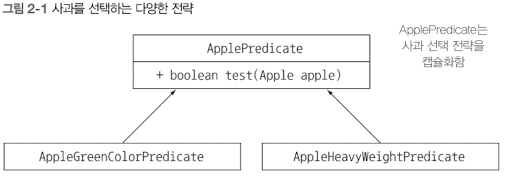
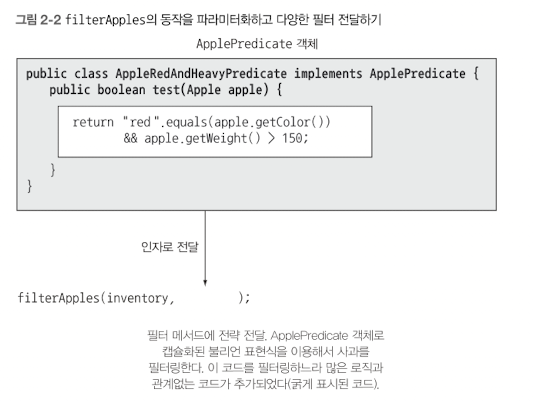
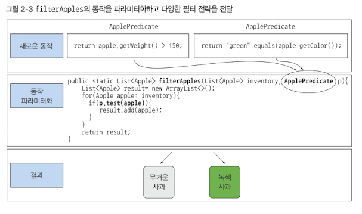

# [모던 자바 인 액션]동작 파라미터화 코드 전달하기

# 2.1 변화하는 요구사항에 대응하기

동작 파라미터화를 이용하면 자주 바뀌는 요구상항에 효과적으로 대응할 수 있다. 동작 파라미터화란 아직은 어떻게 실행할 것인지 결정하지 않은 코드 블록을 의미한다.

## 첫 번째 시도 : 녹생 사과 필터링

사과 색을 정의하는 다음과 같은 Color num이 존재한다고 가정하자.

```java
enum Color { RED, GREEN }

public static List<Apple> filterGreenApples(List<Apple> inventory) {
	List<Apple> result = new ArrayList<>();
	for (Apple apple : inventory) {
		if (GREEN.equals(apple.getColor())) {
			result.add(apple);
		}
	}

	return result;
}
```

여기서 갑자기 농부가 빨간 사과도 필터링하고 싶어졌다. 어떻게 고쳐야 할까? 크게 고민하지 않은 사람이라면 메서드를 복사하여 filterRedApples라는 새로운 메서드를 만들고, if문을 조건을 빨간 사과로 바꾸는 방법을 선택할 수 있다. 이와 같은 방법으로는 빨간 사과를 필터링할 수 있겠지만 나중에 농부가 더 다양한 색으로 필터링하는 등의 변화에는 적절하게 대응할 수 없다. 이런 상황에서는 다음과 같은 규칙이 있다.

`거의 비슷한 코드가 반복 존재한다면 그 코드를 추상화한다.`

## 두 번째 시도 : 색을 파리미터화

어떻게 해야 filterGreenApples의 코드를 반복 사용하지 않고 filterRedApples를 구현할 수 있을까?

```java
public static List<Apple> filterApplesByColor(List<Apple> inventory, Color color) {
	List<Apple> result = new ArrayList<>();
	for (Apple apple : inventory) {
		if (apples.getColo().equals(color)) {
			result.add(apple);
		}
	}

	return result;
}
```

다음 처럼 구현한 메소드를 호출할 수 있다.

```java
List<Apple> greenApples = filterApplesByColor(inventory, GREEN);
List<Apple> greenApples = filterApplesByColor(inventory, RED);
```

그런데 갑자기 농부가 ‘색 이외에도 가벼운 사과와 무거운 사과를 구분하게 해주세요’라고 하면 다음 코드에서 앞으로 바뀔 수 있는 다양한 무게에 대응할 수 있도록 무게 정보 파라미터도 추가했다.

```java
public static List<Apple> filterApplesByWeight(List<Apple> inventory, int weight) {
	List<Apple> result = new ArrayList<>();
	for (Apple apple : inventory) {
		if (apples.getWeight() > weight) {
			result.add(apple);
		}
	}

	return result;
}
```

위 코드도 좋은 해결책이다. 하지만 구현 코드를 자세히 보면 목록을 검색하고, 각 사과의 필터링 조건을 적용하는 부분의 코드가 색 필터링 부분과 대부분 중복된다. 이는 소프트웨 공학의 DRY(같은 것을 반복하지 말것) 원칙을 어기는 것이다.

전체 구현을 고쳐 성능을 고쳐야 한다.

## 세 번째 시도: 가능한 모든 속성으로 필터링

```java
public static List<Apple> filterApplesByWeight(List<Apple> inventory, Color color, int weight, boolean flag) {
	List<Apple> result = new ArrayList<>();
	for (Apple apple : inventory) {
		if ((flag && apple.getColor().equals(color)) || (!flag && apples.getWeight() > weight)) {
			result.add(apple);
		}
	}

	return result;
}
```

다음 처럼 위 메소드를 사용할 수 있다.

```java
List<Apple> greenApples = filterApples(inventory, GREEN);
List<Apple> heavyApples = filterApples(inventory, null, 150, false);
```

이 코드는 형편없는 코드다. 앞으로 요구사항이 바뀌었을 때 유연하게 대응할 수도 없다. 하지만 동작 파라미터화를 이용하면 유연성을 얻는다.

# 2.2 동작 파라미터화

우리의 선택 조건은 다음처럼 결정할 수 있다. 사과의 어떤 속성을 기초해서 불리언값을 반환하는 방법이 있다. 참 또는 거짓을 반환하는 함수를 프레디케이트라고 한다. 선택 조건을 결정하는 인터페이스를 정의하자.

```java
public interface ApplePrdicate {
	boolean test(Apple apple);
}

// 선택 조건을 대표하는 여러 버전의 ApplePrdicate를 정의할 수 있다.

public class AppleHeavyWeightPredicate implements ApplePredicate {
	public boolean test(Apple apple) {
		return apple.getWeight() > 150;
	}
}

public class AppleGreenColorPredicate implements ApplePredicate {
	public boolean test(Apple apple) {
		return GREEN.equals(apple.getColor())
	}
}
```



위 조건에 따라 filter 메서드가 다르게 동작할 것이라고 예상할 수 있다. 이를 전략 디자인 패턴이라고 한다. 전략 디자인 패턴은 각 알고리즘을 캡슐화하는 알고리즘 패밀리를 정의해둔 다음에 런타임에 알고리즘을 선택하는 기법이다. ApplePredicate가 알고리즘 패밀리고 AppleHeavyWeightPredicated와 AppleGreenColorPredicate가 전략이다.

그런데 ApplePredicate는 어떻게 다양한 동작을 수행할 수 있을까? filterApples에서 ApplePredicate 객체를 받아 애플의 조건을 검사하도록 메서드를 고쳐야 한다. 이렇게 동작 파라미터화, 즉 다양한 동작을 받아서 내부적으로 다양한 동작을 수행할 수 있다.

## 네 번째 시도: 추상적 조건으로 필터링

다음은 ApplePredicate를 이용한 필터 메서드이다.

```java
public static List<Apple> filterApples(List<Apple> inventory, ApplePredicate p) {
	List<Apple> result = new ArrayList<>();
	
	for (Apple apple : inventory) {
		if (p.test(apple)) {
			result.add(apple);
		}
	}
	return result;
}
```

### 코드/동작 전달하기

이제 필요한 다양한 ApplePredicate를  만들어서 filterApples 메서드로 전달할 수 있다. 예를 들어 농부가 150그램이 넘는 빨간 사과를 검색해달라고 부탁하면 우리는 ApplePredicate를 적절하게 구현하는 클래스만 만들면 된다. 이제 Apple의 속성과 관련된 모든 변화에 대응할 수 있는 유연한 코드를 준비할 수 있다.

```java
public static ApplRedAndHeavyPredicate implements ApplePredicate {
	public boolean test(Apple apple) {
		return RED.equals(apple.getColor()) && apple.getWeight() > 150;
	}
}

List<Apple> redAndHeavyApples = filterApples(inventory, new AppleRedAndHeavyPredicate());
```



이런씩으로 우리는 ‘코드를 전달’ 할 수 있는 것이다.

### 한개의 파라미터, 다양한 동작

지금까지 살편본 것처럼 컬렉션 탐색 로직과 각 항목에 적용할 동작을 분리할 수 있다는 것이 동작 파라미터화의 강점이다. 한 메서드가 다른 동작을 수행하도록 재활용할 수 있다.



# 2.3 복잡한 과정 간소화

filterApples 메서드로 새로운 동작을 전달하려면 ApplePredicate 인터페이스를 구현하는 여러 클래스를 정의한 다음에 인스턴스화 해야 한다. 이는 상당히 번거로운 작업이다.

```java
public class AppleHeavyWeightPredicate implements ApplePredicate {
	public boolean test(Apple apple) {
		return apple.getWeight() > 150;
	}
}

public class AppleGreenColorPredicate implements ApplePredicate {
	public boolean test(Apple apple) {
		return GREEN.equals(apple.getColor());
}
	
public class FilteringApples {
	public static void main(String[] args) {
		List<Apple> inventory = Arrays.asList(new Apple(80, GREEN),
																					new Apple(155, GREEN),
																					new Apple(120, RED));
		List<Apple> heavyApples = filterApples(inventory, new AppleHeavyWeightPredicate());
		List<Apple> greenApples = filterApples(inventoty, new AppleGreenColorPredicate());
	}
}

public static List<Apple> filterApples(List<Apple> inventory, ApplePredicate p) {
	List<Apple> result = new ArrayList<>();
	for (Apple apple : inventory) {
		if (p.test(apple)) {
			result.add(apple);
			}
		}
		return result;
	}
}
```

로직과 관련 없는 코드가 많이 추가되었다. 자바는 클래스의 선언과 인스턴스화를 동시에 수행할 수 있도록 익명 클래스라는 기법을 제공한다. 익명 클래스를 이용하면 코드의 양을 줄일 수 있다. 하지만 익명 클래스가 모든 것을 해결하는 것은 아니다. 람다 표현식을 사용하면 더 가독성 있는 코드를 구현 할 수 있다.

### 익명 클래스

익명 클래스는 자바의 지역 클래스와 비슷한 개념이다. 익명 클래스는 이름이 없는 클래스이다. 익명 클래스를 사용하면 선언과 인스턴스화를 동시에 할 수 있다. 즉, 즉석에서 필요한 구현을 만들어서 사용할 수 있다.

## 다섯 번째 시도 : 익명 클래스 사용

다음 익명 클래스를 사용해서 ApplePredicate를 구현하는 객체를 만드는 필터링 예제를 다시 구현했다.

```java
List<Apple> redApples = filterApples(inventory, new ApplePredicate() {
	public boolean test(Apple apple) {
		return RED.equals(apple.getColor());
	}
});
```

익명 클래스에는 아직 부적한 점이 있다. 익명 클래스는 여전히 많은 공간을 차지한다.
하지만 람다 표현식을 사용하면 어떻게 코드를 간결하게 정리할 수 있는지 간단히 살펴보자.

## 여섯 번째 시도: 람다 표현식 사용

```java
List<Apple> result = filterApples(inventory, (Apple apple) → RED.euals(apple.getColor()));
```

이전 코드보다 훨씬 간단해졌다.

## 일곱 번째 시도: 리스트 형식으로 추상화

```java
public interface Predicate<T> {
	boolean test(T t);
}

public static <T> List<T> filter(List<T> list, Predicate<T> p) {
	List<T> result = new ArrayList<>();
	for (T e : list) {
		if (p.test(e)) {
			result.add(e);
		}
	}
	return result;
}
```

이제 바나나, 오렌지, 정수, 문자열 등의 리스트에 필터 메서드를 사용할 수 있다.

```java
List<Apple> redApples = filter(inventory, (Apple apple) -> RED.equals(apple.getColor()));
List<Integer> evenNumbers = filter(numbers, (Interger i) -> i % 2 == 0);
```

# 2.4 실전 예제

## Comparator 정렬하기

자바8에는 List에는 sort가 포함되어 있다. 다음과 같은 인터페이스를 갖는 java.util.Comparator 객체를 이용해서 sort 동작을 파라미터화 할 수 있다.

```java
public interface Comparator<T> {
	int compare(T o1, T o2) {
}
```

Comparator를 구현해서 sort 메서드의 동작을 다양화할 수 있다. 예를 들어서 익명 클래스를 이용해서 무게가 적은 순서로 목록에서 사과를 정렬할 수 있다.

```java
inventory.sort(new Comparator<Apple>() {
	public int comapare(Apple a1, Apple a2) [
		return a1.getWeight().compareTo(a2.getWeight());
		}
	});
```

농부의 요구사항이 바뀌면 새로운 요구사항에 맞는 Comparator를 만들어 sort 메소드에 전달 할 수 있다. 실제 정렬 세부사항은 추상화되어 있으므로 신경 쓸 필요 없다. 람다 표현식을 사용하면 간단하게 코드를 구현할 수 있다.

```java
inventory.sort(
(Apple a1, Apple a2) -> a1.getWeight().compareTo(a2.getWeight()));
```

## Runnable로 코드 실행하기

자바 스레드를 이용하면 병렬로 코드 블록을 실행할 수 있다. 자바 8까지는 Thread 생성자에 객체만을 전달할 수 있었으므로 보통 결과를 반환하지 않는 void run 메소드를 포함하는 익명 클래스가 Runnable 인터페이스를 구현하도록 하는 것이 일반적인 방버이었다.

자바에서는 Runnable 인터페이스를 이용해서 실행할 코드 블록을 지정할 수 있다.

```java
public interface Runnable {
	void run();
}
```

Runnable을 이용해서 다양한 동작을 스레드로 실행할 수 있다.

```java
Thread t = new Thread(new Runnable() {
	public void run() {
		System.out.println("Hello World");
	}
});
```

자바 8 부터 지원하는 람다 표현식을 이용하면 다음처럼 스레드 코드를 구현할 수 있다.

```java
Thread t = new Thread(() -> System.out.println("Hello World"));
```

## Callable을 결과로 반환하기

자바 5부터 지원하는 ExecutorService 인터페이스는 태스크 제출과 실행 과정의 연관성을 끊어준다. ExecutorService를 이용하면 태스크를 스레드 풀로 보내고 결과를 Future로 저장할 수 있다는 점이 스레드와 Runnable을 이용하는 방식과는 다르다.

이 개념이 낯설더라도 당장은 Collable 인터페이스를 이용해 결과를 반환하는 태스크를 만든다는 사실만 알아두면 된다.